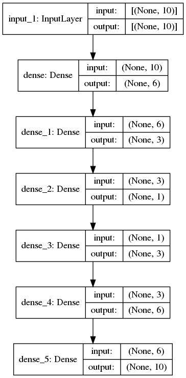
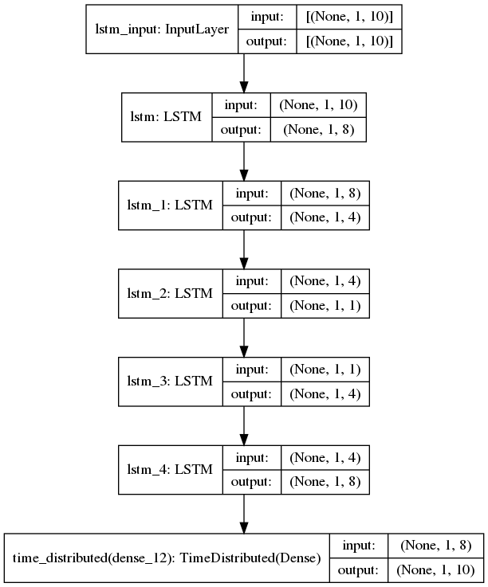

# Log Anomaly Detection Notebook

Log Anomaly Detection 을 진행하면서 사용한 Notebook. model 및 데이터 이해를 위해 사용되었다.

### 01 Autoencoder for HTTP

HTTP의 로그 기록 데이터를 이용하여 비지도 학습인 Autoencoder를 적용.

### 02 Autoencoder for HDFS

기존의 HTTP에서 진행된 방식에서 HDFS의 로그 기록 데이터로 변경하여 비지도 학습인 Autoencoder를 적용.

### 03 Autoencoder for syslog

실제 데이터인 syslog 데이터에 autoencoder를 적용하여 결과 확인.

#### NN_Autoencoder_Architecture

#### LSTM_Autoencoder_Architecture

### 04 LDA for Dataset

토픽 모델링 방법인 LDA 를 로그에 적용하였을때 나오는 결과를 통해 데이터에 대한 이해.

### 05 TF-IDF for Dataset

정보 검색과 텍스트 마이닝에서 이용하는 가중치인 TF-IDF 를 로그에 적용하였을때 나오는 결과를 통해 데이터에 대한 이해.

### 06 Autoencoder for HDFS time

blk를 기준으로 라벨링된 HDFS를 1분 단위로 변경한 데이터에 NN, LSTM Autoencoder를 적용.

### 07 Autoencoder for Syslog time

PID를 기준으로 처리했던 Syslog 데이터를 1분 단위로 변경한 데이터에 NN, LSTM Autoencoder를 적용.

### 08 iso auto for syslog

분단위 Syslog 데이터에 Isolation Forest 를 적용하여 예상 normal data를 생성 해당 데이터에 Autoencoder 를 적용.

## Reference

* Autoencoder : https://github.com/zpettry/AI-Autoencoder-for-HTTP-Log-Anomaly-Detection
* HTTP Data : https://www.kaggle.com/shawon10/web-log-dataset#webLog.csv
* HDFS Data & Lenma preprocess : https://github.com/logpai/loglizer 
* Deeplog : https://github.com/nailo2c/deeplog
* Unsupervised log message anomaly detection : https://www.sciencedirect.com/science/article/pii/S2405959520300643